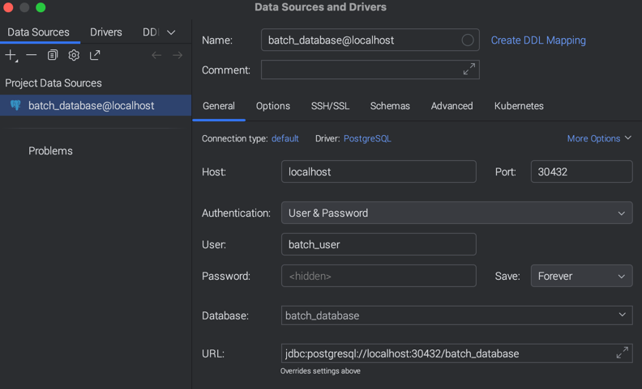

# Postgres + pgAdmin Kubernetes Manifests

This repository contains Kubernetes manifests to run a PostgreSQL database and pgAdmin (web UI) locally on a Kubernetes cluster (Docker Desktop). The manifests provide deployments, services, a PersistentVolume/Claim for storage, and an Ingress resource for HTTP access.

## Files
- `postgres-deploy.yaml`  — Deployment, Service, PV and PVC for PostgreSQL.
- `pgadmin-deploy.yaml`   — Deployment, Service, PVC, and Ingress for pgAdmin.
- `postgres-secrets.yaml` — (ignored) Example/expected secret for Postgres credentials (not committed).
- `pgadmin-secrets.yaml`  — (ignored) Secret for pgAdmin default password (not committed).

## Prerequisites
- kubectl configured to talk to your cluster (Docker Desktop Kubernetes, minikube, etc.)
- Docker Desktop with Kubernetes enabled or another local k8s provider
- (Optional) an Ingress controller (e.g., ingress-nginx) if you want to use the provided Ingress

## Quick start (local)
1. Create secrets (these files are gitignored — create them locally or create secrets from the command line). Example commands:

```bash
kubectl create secret generic postgres-secret \
  --from-literal=postgres-root-username=postgres \
  --from-literal=postgres-root-password='example-password' 

kubectl create secret generic pgadmin-secret \
  --from-literal=pgadmin-default-password='pgadmin-password'
```

2. Apply the manifests

```bash
kubectl apply -f postgres-deploy.yaml
kubectl apply -f pgadmin-deploy.yaml
```

3. Check resources

```bash
kubectl get all -n default
```


4. Access postgres via cli

```bash
# simple: first pod matching label
kubectl exec -it "$(kubectl get pods -l app=postgres -o jsonpath='{.items[0].metadata.name}')" -- /bin/bash

# more robust: first pod in Running state
kubectl exec -it "$(kubectl get pods -l app=postgres -o jsonpath='{.items[?(@.status.phase=="Running")].metadata.name}' | tr ' ' '\n' | head -n1)" -- /bin/bash
```

5. Accessing pgAdmin
- NodePort (should work on Docker Desktop): open http://localhost:30200
- Port-forward (reliable regardless of cluster networking):
  ```bash
  kubectl port-forward svc/pgadmin 8080:80 -n default
  # then open http://localhost:8080
  ```

- Ingress: If you prefer to use Ingress (the manifest uses `spec.ingressClassName: "nginx"`) you must have an ingress controller running. Example to install ingress-nginx:

```bash
kubectl apply -f https://raw.githubusercontent.com/kubernetes/ingress-nginx/controller-v1.8.1/deploy/static/provider/cloud/deploy.yaml
```

Then access via http://localhost (if your Ingress host is `localhost`). Make sure the ingress controller's class name matches `ingressClassName`.

## Useful k8s commands summary

```bash
# apply manifests
kubectl apply -f postgres-deploy.yaml
kubectl apply -f pgadmin-deploy.yaml

# view pods/services/pvc
kubectl get pods,svc -n default
kubectl get pvc,pv
kubectl describe pod -l app=pgadmin -n default
kubectl logs -l app=pgadmin -n default --tail=200

# restart deployment
kubectl rollout restart deployment/pgadmin -n default

# port-forward
kubectl port-forward svc/pgadmin 8080:80 -n default

# inspect PV
kubectl get pv postgres-pv -o yaml
kubectl get pv pgadmin-pv -o yaml

# cleanup
kubectl delete -f pgadmin-deploy.yaml
kubectl delete -f postgres-deploy.yaml
kubectl delete secret pgadmin-secret postgres-secret || true

# kill port-forwards 
pgrep -af 'kubectl port-forward'
ps aux | grep '[k]ubectl port-forward'
# kill by PID
kill <PID>
# or kill all port-forwards (careful)
pkill -f 'kubectl port-forward'

# 1) Check the postgres pod/service
kubectl get pods -l app=postgres
kubectl get svc postgres

# 2) Start a local port-forward (run in a separate terminal)
#    For the Service:
kubectl port-forward svc/postgres 5432:5432
#    Or for the deployment/pod:
kubectl port-forward deploy/postgres 5432:5432

# 3) Retrieve DB credentials from the Kubernetes secret (decodes base64)
kubectl get secret postgres-secret -o go-template='{{.data.postgres-root-username | base64decode}}'
kubectl get secret postgres-secret -o go-template='{{.data.postgres-root-password | base64decode}}'
# Or both on one line:
kubectl get secret postgres-secret -o go-template='{{.data.postgres-root-username | base64decode}}:{{.data.postgres-root-password | base64decode}}'

# 4) (Alternative) Use NodePort directly (may work on Docker Desktop):
#    connect to localhost:30432 instead of port-forwarding
```

## Initialize db with a custom database and user

Connect to your postgres instance

```bash
kubectl exec -it deployment/postgres -- env PGPASSWORD=$(kubectl get secret postgres-secret -o jsonpath='{.data.postgres-root-password}' | base64 --decode) psql -U $(kubectl get secret postgres-secret -o jsonpath='{.data.postgres-root-username}' | base64 --decode) -d $(kubectl get configmap postgres-configmap -o jsonpath='{.data.postgres-dbname}')
```

Create database
```bash
create database batch_database;
```

Create role
```bash
create role batch_developer;
```

Grant privileges for the role created to the database
```bash
grant all privileges on database batch_database to batch_developer;
```

Connect to the database
```bash
\c batch_database
``` 

Create schema
```bash
create schema batch_schema;
```

Grant privileges for the role created to the schema
```bash
grant all on schema batch_schema to batch_developer;
```

Grant privileges to all the tables
```bash
grant all privileges on all tables in schema batch_schema to batch_developer;
```

Create user
```bash
create user batch_user password 'password' in group batch_developer login;
```
Enlist database
```bash
\l+
```

Enlist role
```bash
\dg+
```

Enlist schema
```bash
\dn+ batch_schema
```

Enlist tables
```bash
\dt+ batch_schema.*
```

Clear console
```bash
\! clear
```

## Configure IntelliJ Data Source



> [!NOTE]
> You can use the NodePort service or port-forwarding to connect IntelliJ to the Postgres instance.
>  - NodePort: `localhost:30432`
>  - Port-forward: `localhost:5432` with the command: `kubectl port-forward svc/postgres 5432:5432`

## Reference

- https://blog.devgenius.io/how-to-deploy-postgresql-db-server-and-pgadmin-in-kubernetes-a-how-to-guide-57952b4e29a8
- https://stackoverflow.com/questions/71352556/creating-role-with-full-access-to-schema-and-assign-it-to-user
